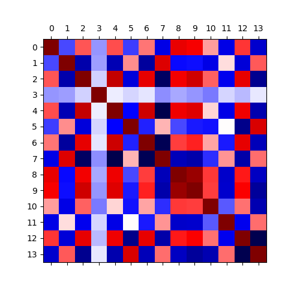
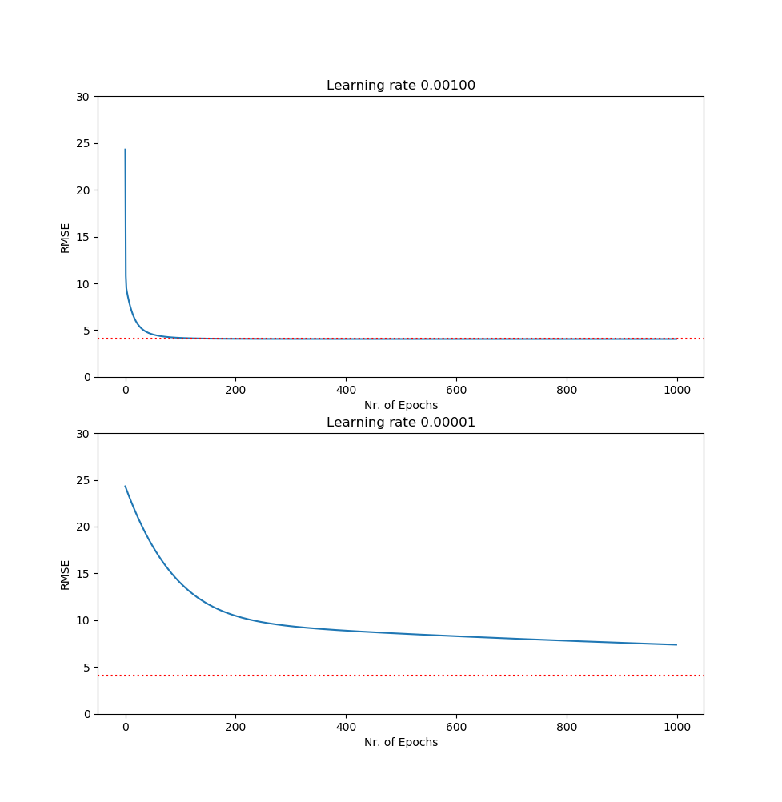

# Linear regression (LR) on the Boston housing dataset

The [Boston housing dataset](https://www.cs.toronto.edu/~delve/data/boston/bostonDetail.html) is based on 506 entries 
consisting of 14 different variables each. In the following example, the median house value (medv) is predicted based on
the remaining 13 variables by means of Linear Regression (LR). That is, LR is first directly computed by means of normal 
equation. Second, LR is found approximative via Gradient Descent (GD).

## Tutorial

## Requirements